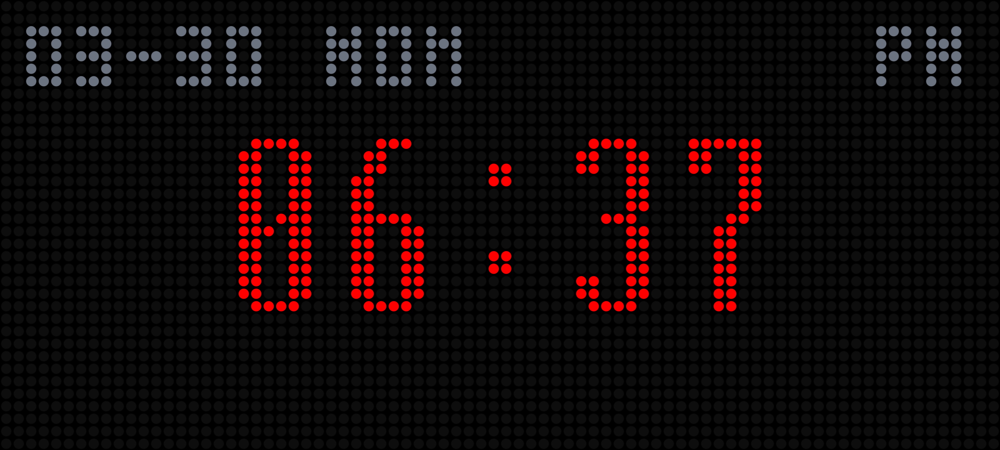
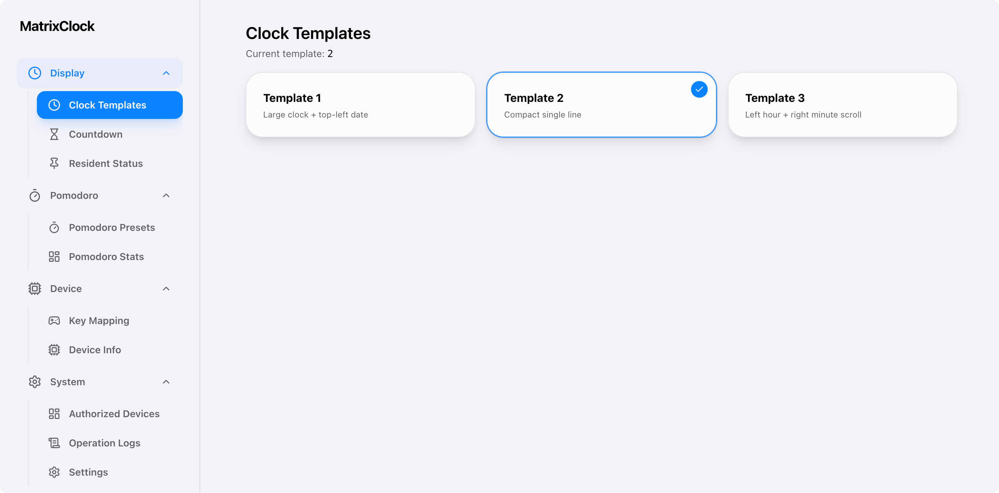

# MatrixClock

[](https://github.com/sha2kyou/MatrixClock/actions/workflows/build-apk-on-tag.yml)
[](https://github.com/sha2kyou/MatrixClock/releases)
[](https://github.com/sha2kyou/MatrixClock/commits/main)


MatrixClock is an Android app for matrix-style clock and status display.

**Layout:** Android code in `app/`; the LAN admin panel (Vite + React) lives in **`admin/`** at the repository root. Built assets are synced into `app/src/main/assets/web/` before packaging (see **Web admin** below).

## Download

Get the APK from [**Releases**](https://github.com/sha2kyou/MatrixClock/releases/latest) (file name `MatrixClock-v*.apk`).

## Previews

Screenshots live under [`preview/`](preview/).

**Clock**

| | | |
|:---:|:---:|:---:|
|  |  |  |

**Pomodoro**

| | | |
|:---:|:---:|:---:|
|  |  |  |

**Web admin (LAN)**



## Requirements

- **Android**: 8.0 or newer (API 26+).
- **LAN**: Phone and browser PC must be on the **same Wi‑Fi / LAN** (guest networks often isolate clients).
- **Firewall / router**: Unblock inbound **TCP port 6574** to the phone if your network blocks device-to-device access.
- **App running**: The HTTP server runs in the app process; keep the app running (foreground or in recents). It stops when the app is fully closed or the process is killed.

## Permissions & privacy

Declared permissions: `INTERNET`, `ACCESS_WIFI_STATE`, `VIBRATE`. No location, contacts, or microphone. No bundled third-party analytics SDK. Anyone on the same LAN who can reach the phone’s admin URL can attempt the in-app bind/auth flow.

## Main Features

- LAN admin UI over **HTTP on port 6574** (NanoHTTPD) while the app is running.
- Custom key bindings (short/long/double press).
- Clock, Countdown, Status, and Pomodoro modes.

## Default hardware keys

Uses **Volume +** and **Volume −** (same defaults on both keys). The app consumes these keys so the system volume may not change while the clock is open.

| Gesture | Default action |
|--------|----------------|
| **Short press** | **Pomodoro**: start the primary preset (or leave the pomodoro/text screen and return to the clock). |
| **Long press** (~500 ms) | **Menu**: open settings. |
| **Double press** (~350 ms between taps) | **Switch pomodoro preset**: next preset while a pomodoro countdown is showing (needs at least two presets; otherwise does nothing). |

Remap actions in the web admin **Keys** section after binding.

## Quick Start

1. Install, open the app, stay on the **same LAN** as your computer (see Requirements).
2. In a browser, open `http://<device-ip>:6574` (shown in-app when Wi‑Fi is up).
3. Bind once, then manage display/settings from the web admin.

## FAQ

- **Can’t open `http://<device-ip>:6574`?** Check same Wi‑Fi, correct IP, app is running, and that nothing blocks port 6574 (firewall / “AP isolation” on the router).
- **APK won’t install?** Use the APK from **Download** above; allow **Install unknown apps** for your browser or file manager if prompted.
- **Still fails?** Try another browser, confirm the phone’s IP didn’t change (DHCP), and temporarily disable VPN on the phone/PC.

## Versioning

Tags look like `v1.0.6`. CI maps them to `versionName` (without `v`) and `versionCode = major×10000 + minor×100 + patch`. Artifacts are published via [**Releases**](https://github.com/sha2kyou/MatrixClock/releases) (see **Download** for the APK name pattern).

## Build

```bash
./gradlew :app:assembleRelease
```

`assembleRelease` needs a release keystore (default path `app/release.keystore`, or configure `SIGNING_*` via environment variables or `-P` Gradle properties). For a quick dev install without signing setup, use `./gradlew :app:assembleDebug`.

## Web admin (Vite + React)

The web admin is a Vite + React app whose **source** lives in [`admin/`](admin/) at the repo root (not bundled raw in the APK: `scripts/sync-web-admin.sh` runs `npm install` / `npm run build` there and copies `dist/` into `app/src/main/assets/web/` for the Android app).

After UI changes:

```bash
./scripts/sync-web-admin.sh
```

Override the default path with `MATRIX_WEB_SRC` if the admin project is elsewhere.

For local frontend development, add a `.env` in `admin/` with `MATRIX_PROXY_TARGET=http://<device-ip>:6574`, then run `npm run dev` so `/api` proxies to the phone.

`MatrixServer` serves `GET /` (`index.html`) and `GET /assets/*` for the Vite-built JS/CSS.

## HTTP API (LAN, port 6574)

Base URL: `http://<device-ip>:6574`. Unless noted, protected routes require a valid **`token`** query parameter (the string returned after a successful bind). Invalid or missing tokens typically yield **`403`** with body `Forbidden`.

The bundled web admin sends `token` and most other fields as **URL query parameters** (including on `POST`). NanoHTTPD exposes them via `session.parameters`; other clients could use a form body where supported. Routes that expect JSON use **`Content-Type: application/json`** and a body (see below).

### Static & HTML

| Method | Path | Auth | Description |
|--------|------|------|-------------|
| `GET` | `/` | No | Web admin `index.html`. Returns **403** plain text if the web UI is disabled in app settings. |
| `GET` | `/assets/*` | No | Vite build assets (JS, CSS, fonts, images) under `assets/`. |

### Auth

| Method | Path | Auth | Parameters / body | Response |
|--------|------|------|-------------------|----------|
| `POST` | `/api/auth/bind` | No | (none) | **200** plain text: session token on success, or `DENIED`. |
| `POST` | `/api/auth/reset` | Valid `token` | Query: `token` (removes **that** session) | **200** `OK` or **403** `Forbidden`. |
| `GET` | `/api/auth/list` | `token` | — | **200** JSON array of `AuthRecord` (see models below). |
| `POST` | `/api/auth/device-info` | `token` | Query: `token`. **Body:** JSON `DeviceInfoUpdate` | **200** `OK`, **400** on bad JSON/missing body. |
| `POST` | `/api/auth/revoke` | `token` | Query: `token`, `revokeToken` | **200** `OK` or **403**. |

### Display & mode

| Method | Path | Auth | Parameters | Notes |
|--------|------|------|------------|--------|
| `POST` | `/api/mode` | `token` | `mode` — `CLOCK` or `TEXT` (if omitted, defaults to **`CLOCK`**) | Switches display mode. **400** if `mode` is present but invalid. |
| `GET` | `/api/clock/template` | `token` | — | **200** JSON `{"template": <int>}` (stored value 1–3). |
| `POST` | `/api/clock/template` | `token` | `template` (int, clamped 1–3) | **200** `OK`. |
| `POST` | `/api/display` | `token` | `text`, optional `color`, `duration`, `style`, `icon` | `duration` **omitted**, **null** (unparseable), or **≤ 0** → **persistent** status (no countdown); positive → countdown seconds. `style` optional, clamped 1–3, default **1** in app UI logic. |

### Pomodoro

| Method | Path | Auth | Parameters / body |
|--------|------|------|-------------------|
| `GET` | `/api/pomodoro/configs` | `token` | — → JSON array of `PomodoroConfig`. |
| `POST` | `/api/pomodoro/configs` | `token` | Query: `token`. **Body:** JSON array of `PomodoroConfig`. Errors: **400** `Missing body`; **500** plain text if JSON decode fails. |
| `GET` | `/api/pomodoro/sessions` | `token` | — → JSON array of `PomodoroSession`. |

### Device & keys

| Method | Path | Auth | Parameters / body |
|--------|------|------|-------------------|
| `GET` | `/api/device/info` | `token` | — → JSON `DeviceInfo`. **500** on internal error. |
| `GET` | `/api/keys/settings` | `token` | — → JSON object with `volUpShort`, `volUpLong`, `volUpDouble`, `volDownShort`, `volDownLong`, `volDownDouble`. |
| `POST` | `/api/keys/settings` | `token` | Same six fields as **query** parameters. Allowed values: short/long → `menu` \| `pomodoro`; double → `menu` \| `pomodoro` \| `none` \| `switch_pomodoro` (invalid values fall back to defaults). |

### Operation log

| Method | Path | Auth | Parameters | Response |
|--------|------|------|------------|----------|
| `GET` | `/api/oplog` | `token` | `page` (≥ 0, default 0), `pageSize` (10–100, default 50) | **200** JSON `{"items":[...],"hasMore":bool}` where each item is `OpLogEntry`. |

### JSON models (Kotlin `kotlinx.serialization` field names)

- **`AuthRecord`**: `token`, `ip`, `deviceName`, `deviceModel`, `systemVersion`, `batteryLevel`, `createdAt`.
- **`DeviceInfo`** (phone): `model`, `manufacturer`, `device`, `androidVersion`, `sdkInt`, `batteryLevel`, `batteryStatus`, `screenWidthPx`, `screenHeightPx`, `screenDensity`, `isCharging`.
- **`DeviceInfoUpdate`** (client → `/api/auth/device-info`): optional `deviceName`, `deviceModel`, `systemVersion`, `batteryLevel`.
- **`PomodoroConfig`**: `id`, `text`, `durationSec`, `colorHex`, `isPrimary`, `countdownStyle` (1–3), `cycleTotal`.
- **`PomodoroSession`**: `configId`, `configText`, `startTimeMillis`, `plannedDurationSec`, `completed`, `actualDurationSec`.
- **`OpLogEntry`**: `timeMillis`, `action`, `detail`, `ip`.

Implementation reference: [`app/src/main/java/cn/tr1ck/matrixclock/data/api/MatrixServer.kt`](app/src/main/java/cn/tr1ck/matrixclock/data/api/MatrixServer.kt). Frontend wrappers: [`admin/src/matrix/api.ts`](admin/src/matrix/api.ts).

## License

This project is licensed under the [MIT License](LICENSE).

